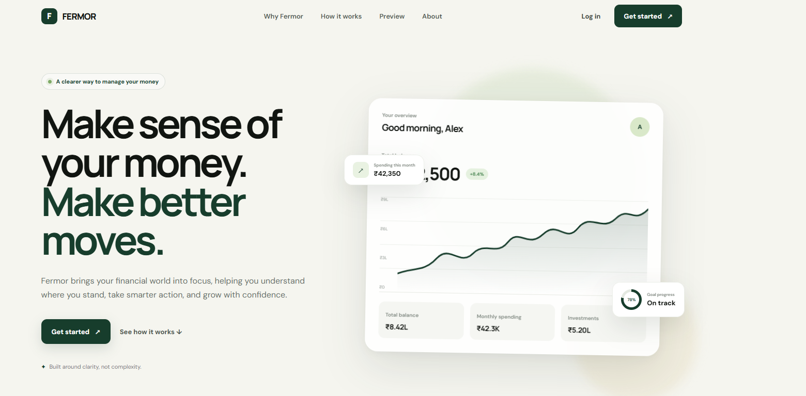
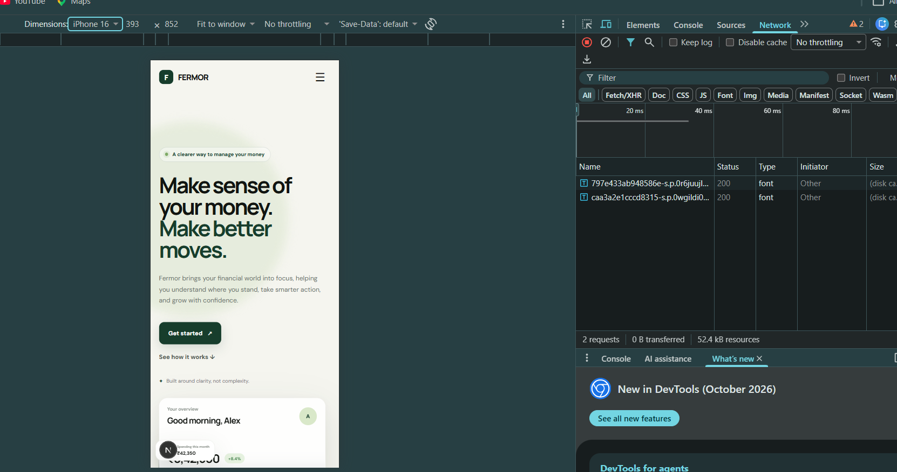
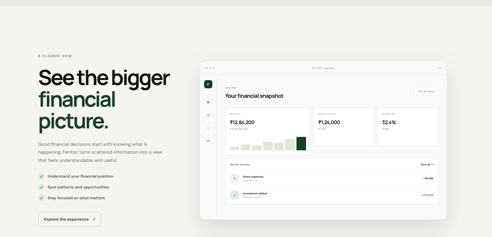

# Fermor — Financial Clarity Homepage

A modern, responsive homepage concept for Fermor, designed as part of the Frontend Developer Assignment.

## Overview

Fermor is focused on making finance simpler, clearer and easier to use.

This homepage is designed around the idea of helping users:

- Understand their financial position
- Take better financial decisions
- Build towards long-term financial growth

The design uses a clean fintech visual language with a focus on clarity, hierarchy and ease of use.

## Live Demo

https://fermOR-homepage.vercel.app

## Tech Stack

- Next.js
- React
- TypeScript
- Tailwind CSS
- CSS
- Google Fonts

## Key Sections

- Responsive navigation
- Hero section
- Financial dashboard concept
- Financial problem statement
- Understand / Act / Grow section
- Product dashboard preview
- Why Fermor section
- Final call-to-action
- Responsive footer

## Design Decisions

### 1. Visual Direction

I chose a minimal fintech aesthetic using a cream, white and deep green palette. The intention was to communicate trust, calmness and financial clarity.

### 2. Product Thinking

The homepage starts with the core value proposition and then moves through the user's problem, Fermor's approach and a visual representation of the product experience.

### 3. Dashboard Concept

A financial dashboard was included to make the product idea tangible and show how Fermor could present financial information in a clear way.

### 4. Responsive Design

The layout has been designed to work across desktop and mobile screen sizes, including a responsive navigation menu and mobile-friendly content sections.

## Running Locally

Clone the repository:

```bash
git clone https://github.com/sharanvm/fermOR-homepage.gitgit add README.md
## Screenshots

### Desktop Homepage



### Mobile Homepage



### Product Preview

